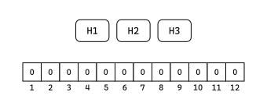
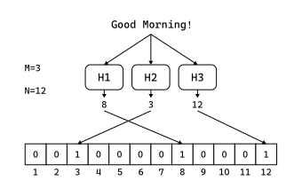

# Bloom Filter

布隆过滤器

## 概要

布隆过滤器是一种基于哈希函数的过滤器，用于过滤一个集合中符合特定哈希特征的元素。通过调整布隆过滤器的相应参数，可以控制过滤的精确程度。

## 技术原理

布隆过滤器由**M**个哈希函数和大小为**N**的二进制数组组成。

大体如下：



其中，每个哈希函数的算法是不同的，但它们均能接受任意字符串的输入，并产生范围为<b>[0,N-1]</b>的输出。

在应用布隆过滤器时，将一个字符串按照固定次序输入每个哈希函数。假定M=3，我们能得到3个输出，它们分别来自这3个不同的哈希函数。在二进制数组（N=12）中寻找与输出相同的下标并将其标志为1$^{*1}$，我们便得到了该字符串（即一个*模式*）的一组哈希特征。

大体如下：



当然，我们可以选择更多的哈希函数和更大的二进制数组来调整布隆过滤器的精确程度。当哈希函数的数量M增加时，会在二进制数组上留下更多的标记，这相当于更详细地描述了模式$^{*2}$。当二进制数组的大小N增加时，我们将得到更大的哈希空间来描述模式，也提高了过滤的精确性。通过调整M与N的大小，我们便可以控制过滤的精确程度。

通过对一个数据集中的所有数据依次应用布隆过滤器并与目标二进制数组进行比对，我们就能过滤到一组符合要求的数据，其中可能含有我们想要的模式。

## 实现

本例使用C++实现一个简单的布隆过滤器。

```C++
//通过传入num来构造不同的哈希函数
int hashf(int range, int num, const string &mode) {
    int i = 0;//最好使用size_t
    for (auto c:mode) {
        i += (int)//让结果随机
                (abs(c - 7) * 7.37 * (c + 128) * (c + num));
    }
    return abs(i) % range;//取绝对值是为了防止溢出
}

int *bloom_filter(int M, int N, int *arr, const string& mode) {
    int range = N;
    for (; N > 0; --N) {//初始化arr
        arr[N - 1] = 0;
    }
    for (; M > 0; --M) {//标记哈希位
        arr[hashf(range, M, mode)] = 1;
    }
    return arr;
}
```

设置哈希函数个数为8、二进制数组长度为36，对字符串`Good Morning!`应用布隆过滤器得到的结果如下：

```text
0 0 1 0 0 0 1 0 0 1 0 0 0 0 0 0 0 1 0 1 0 0 0 1 0 0 0 0 0 0 0 1 1 0 0 0
```

## 应用

布隆过滤器具有模糊查询的性质和很好的保密性，这两种特征使得它非常适合基于非安全信道的数据获取。在数字货币钱包中，通常使用布隆过滤器来向完全节点查询交易地址：通过将目标地址输入布隆过滤器，将得到的二进制数组发往完全节点，使得完全节点能够返回一组符合该数组的交易信息。通过这种方式，钱包能够避免目标地址被他人知晓从而造成安全问题。这就好比你想确认班级中是否的确有某人而不方便透露该人的姓名，于是让同学枚举所有同姓的同学一样。

当然，在精度足够高的情况下，布隆过滤器也可以被当作精确索引使用，就像数据库中的哈希索引一样。

---

## 注解

1. 可能出现多个哈希函数结果相同的情况，在这种情况下，标记位应当为1（只标记不撤销）。
2. 当M过大时，会出现二进制数组重复置位逐渐增多直到全部置位的情况，在这种情况下，M的大小与过滤精确度是成反比的。
3. 本代码仅仅用于演示目的，良好的哈希函数应将模式均匀地映射到哈希空间每一个位置。
